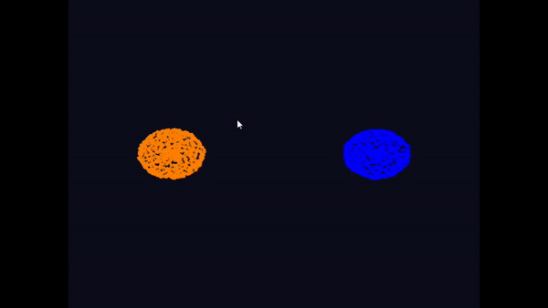

# GPU (ROCm HIP) Accelerated N Body Simulations

Running on a AMD Radeon 7800XT on windows, using OpenGL for graphics.

### Demo
Demo N body simulation with 2 galaxies with 10,000 bodies each, with 1 dense centre body in each galaxy:

